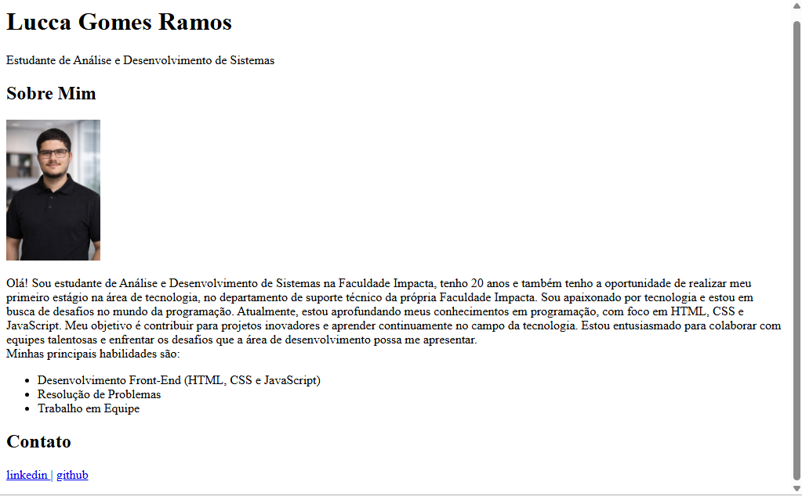

# 👨‍💻 Página Pessoal - Sobre Mim

Este projeto consiste em uma página pessoal desenvolvida com **HTML5**, com foco na aplicação de estrutura semântica, organização de conteúdo e boas práticas iniciais de desenvolvimento web.

---

## 📸 Preview do Projeto

  

---

## 📌 Sobre o Projeto

A página apresenta informações pessoais e profissionais, estruturadas utilizando tags semânticas do HTML5, priorizando clareza, organização e acessibilidade.

---

## 🛠️ Tecnologias Utilizadas

- HTML5

---

## 🧠 Conceitos Aplicados

- Estrutura semântica (`header`, `main`, `section`)
- Hierarquia correta de títulos (`h1`, `h2`)
- Uso de imagem com atributo `alt`
- Lista não ordenada (`ul`, `li`)
- Links externos
- Organização de conteúdo

---

## 🎯 Objetivo

Consolidar fundamentos de desenvolvimento front-end como base para evolução em:

- CSS
- JavaScript
- Responsividade
- Estruturação de portfólio completo

---

## 📈 Melhorias Futuras

- [ ] Adicionar estilização com CSS
- [ ] Implementar layout responsivo
- [ ] Melhorar design visual
- [ ] Publicar versão online (deploy)

---

## 👨‍💻 Autor

**Lucca Gomes Ramos**  
📍 São Paulo - SP  

🔗 LinkedIn: https://www.linkedin.com/in/lucca-ramos/  
🔗 GitHub: https://github.com/Lucca-Gomes  

---

⭐ Projeto desenvolvido para fins de aprendizado.